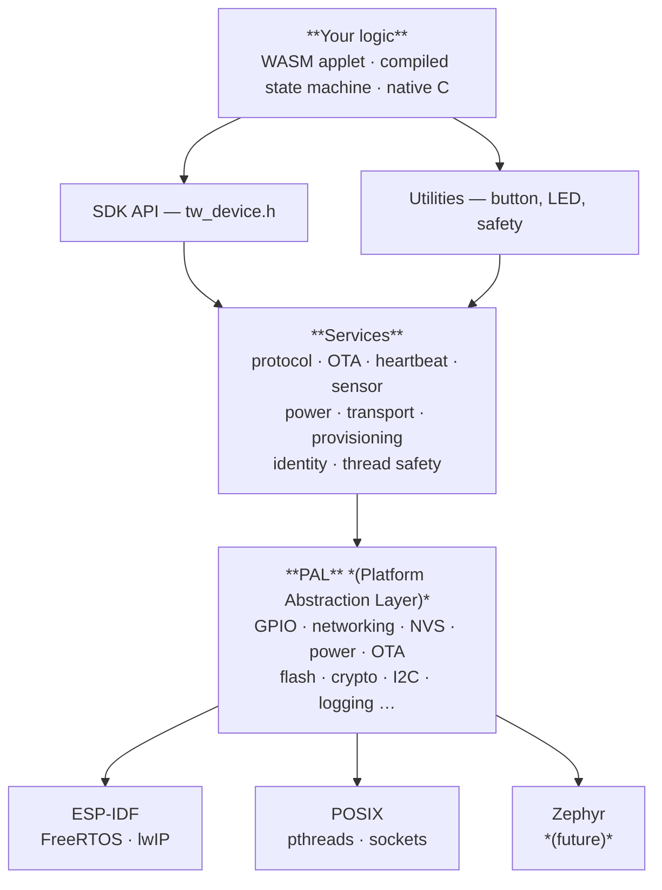

# Tinkwell Firmwareless: Device SDK

> Build connected IoT devices without writing firmware from scratch.

[Tinkwell Firmwareless](https://github.com/arepetti/Tinkwell-Firmwareless) lets product teams focus on application logic instead of firmware plumbing.
The SDK handles transport, provisioning, OTA updates, hub communication, and power management.
You choose **how** to deliver your device logic -- there are three paths, and they can coexist on the same device.

**The SDK is optional.** What matters is the [wire protocol](docs/protocol/wire-specification.md) between device and hub.
Any firmware that speaks binary CoAP (or MQTT, or any channel the hub exposes) and follows the documented heartbeat / command / OTA / applet conventions is a valid Tinkwell Firmwareless device.
You can write 100% of your own code in any language on any RTOS -- the SDK simply makes it faster by handling the boilerplate for you.

**Legacy devices fit too.** Because the hub is built on [Tinkwell](https://github.com/arepetti/tinkwell), it is not limited to a single transport.
CoAP, MQTT, and custom channels can coexist in the same deployment.
A traditional device that already speaks MQTT can join the ecosystem by configuring a matching hub channel -- no firmware change required.
Even a fully legacy device with no network awareness of Tinkwell can be bridged: pair it with a small firmlet (running on the hub or on a companion board) that translates the device's native protocol into Tinkwell messages.
This makes Firmwareless a practical migration path for brownfield installations, not just greenfield products.

## Three ways to build device logic

### WASM Applets -- write in any language, push from the hub

Write your logic in TypeScript, Rust, C, or any language that compiles to `wasm32`.
The hub pushes the `.wasm` binary to the device at runtime; no reflash, no reboot.
Hot-swap applets in the field whenever requirements change.

```bash
# Build an applet, copy it to the device flash stub, run
npm install && npm run build              # AssemblyScript example
cp build/thermostat.wasm ~/.tw-device/applet.bin
./build/applet_device
```

See [Your first applet](docs/getting-started/your-first-applet.md) to try this in 5 minutes.

### Compiled State Machines -- declare logic, compile to native C or WASM

Define behavior in the Tinkwell state machine DSL and compile it.
Two compilation targets are available:

- **`--target c`** (native firmware) -- generates a single `.c` file that calls the PAL directly.
  No WASM runtime needed, native execution speed.
  You implement sensor reads and wire `sm_init()`/`sm_tick()` into `tw_device_config_t`.
- **`--target wat`** (WASM applet) -- generates a `.wat` module that runs on the WAMR interpreter.
  Can be hot-pushed from the hub like any applet.

Both targets handle sensor reads, GPIO writes, LED patterns, safety conditions, and transition logic.
Zero hand-written application code on the device side.

See [Choosing your approach](docs/guides/choosing-your-approach.md) for how this fits with the other paths.

### Native C -- traditional compiled firmware

Fill in a config struct with your CoAP resources, sensor callbacks, and tick function.
The SDK provides the main loop, networking, OTA, heartbeat, and everything else.
About 50--200 lines of C for a typical device.

```c
static const tw_device_config_t config = {
    .name             = "irrigation-controller",
    .fw_version       = "1.0.0",
    .resources        = resources,
    .on_init          = irrigation_init,
    .on_tick          = irrigation_tick,
    .tick_interval_ms = 5000,
};
TW_DEVICE_MAIN(&config)
```

See [Quick start](docs/getting-started/quick-start.md) to build and run the thermostat example in 5 minutes.

## Quick start

```bash
git clone https://github.com/arepetti/tinkwell-firmwareless-device.git
cd tinkwell-firmwareless-device
./scripts/demo.sh
```

This builds the thermostat example, starts a local hub, and shows heartbeats flowing.
On Windows use [`scripts/demo.ps1`](scripts/demo.ps1), or run the Bash script under WSL.

## Architecture at a glance



Nothing above the PAL line includes vendor headers.
The core compiles and runs on POSIX (Linux / macOS / WSL) for development and CI, and on ESP-IDF for real hardware.

This diagram shows the SDK path.
If you are writing your own firmware from scratch or integrating a legacy device, the only hard requirement is the [wire protocol](docs/protocol/wire-specification.md) -- everything above that line is yours to replace.

## Documentation

Full documentation lives in [`docs/`](docs/README.md).
Highlights:

| Start here | |
|---|---|
| [Quick start](docs/getting-started/quick-start.md) | Build the thermostat in 5 minutes (native C path) |
| [Your first applet](docs/getting-started/your-first-applet.md) | Push a WASM applet with zero C (applet path) |
| [Choosing your approach](docs/guides/choosing-your-approach.md) | Applets vs state machines vs native C |
| [Build your own device](docs/getting-started/build-your-device.md) | Turn the thermostat into your project |

| Guides | |
|---|---|
| [Writing applets](docs/guides/writing-applets.md) | Language guides, contract, testing |
| [ESP-IDF](docs/guides/esp-idf.md) | Build, flash, and monitor on real hardware |
| [Provisioning](docs/guides/provisioning.md) | BLE, SoftAP, LAN setup flows |
| [OTA updates](docs/guides/ota-updates.md) | Push firmware from the hub |
| [Porting](docs/guides/porting.md) | ARM Cortex-M and other boards |

| Reference | |
|---|---|
| [C API](docs/reference/api.md) | Public SDK headers |
| [Host API](docs/reference/host-api.md) | WASM host functions for applets |
| [PAL](docs/reference/pal.md) | Platform abstraction layer |
| [Kconfig](docs/reference/kconfig.md) | All compile-time options |
| [Wire specification](docs/protocol/wire-specification.md) | Canonical protocol reference |
| [Scripts](scripts/README.md) | Provisioning, build, demo, QEMU tools |

## Examples

| Example | Path | Description |
|---------|------|-------------|
| [Thermostat](examples/thermostat/) | Native C | Temperature monitoring, safety limits, state machine |
| [Applet device](examples/applet-device/) | WASM applets | Dynamic logic pushed from the hub |
| [Minimal](examples/minimal/) | Native C | ~60 lines, the simplest possible device |
| [Factory](factory/) | -- | Factory provisioning partition |

## Target hardware

Primary: **ESP32-C6** (RISC-V, WiFi 6 + BLE 5 + Thread).
Also tested on ESP32-C3 and ESP32-H2.
The POSIX backend runs on Linux, macOS, and WSL with no hardware at all.

## Related repositories

This repository is part of the [Tinkwell Firmwareless](https://github.com/arepetti/tinkwell-firmwareless) platform.
Sibling repositories:

- [tinkwell-firmwareless-hub](https://github.com/arepetti/tinkwell-firmwareless-hub) -- Edge hub: orchestrates devices, pushes applets and OTA updates
- [tinkwell-firmwareless-repository](https://github.com/arepetti/tinkwell-firmwareless-repository) -- Firmlet repository
- [tinkwell-firmwareless-statemachines-compiler](https://github.com/arepetti/tinkwell-firmwareless-statemachines-compiler) -- Compiles state machines to native C firmware or WASM applets
- [tinkwell-statemachines](https://github.com/arepetti/tinkwell-statemachines) -- Declarative state machine engine
- [Tinkwell](https://github.com/arepetti/tinkwell) -- The core runtime and coordinator

## License

MIT.
See [LICENSE](../../../LICENSE).
