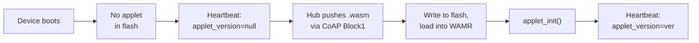
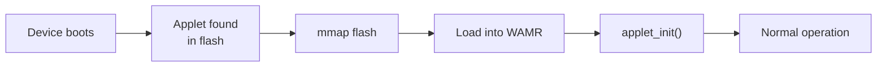
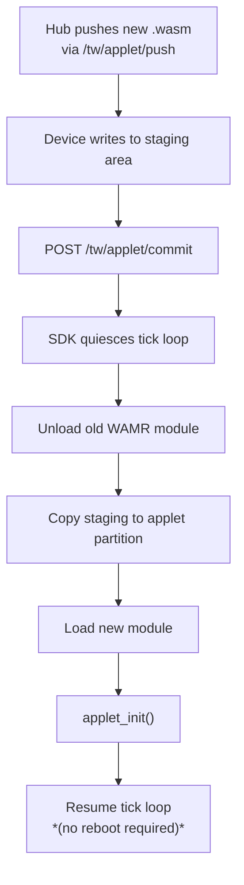

# Applet Runtime

## Overview

The applet runtime replaces compiled-in application logic with a WASM interpreter.
The application is a `.wasm` binary pushed from the hub and stored in flash.

This connects to the broader Tinkwell firmlet ecosystem:

1. **Firmlet Registry** (cloud) -- stores and compiles WASM modules
2. **Edge Hub** -- downloads firmlets, pushes them to devices
3. **Device** (this runtime) -- receives, stores, and interprets them

## WAMR (WebAssembly Micro Runtime)

[WAMR](https://github.com/bytecodealliance/wasm-micro-runtime) is the interpreter used on the device.
Key properties:

- ~50 KB code footprint in interpreter mode
- First-class ESP-IDF support
- Works on Linux/macOS (POSIX) for development
- Sandboxed: WASM modules cannot access memory outside their sandbox
- Supports XIP (Execute In Place) from flash

## Flash storage

The WASM binary is stored in a dedicated flash partition (not RAM):

- **ESP-IDF**: A named partition (`applet`) in the partition table.
  Memory-mapped via `esp_partition_mmap` for XIP.
- **POSIX**: A regular file under `$HOME/.tw-device/applet.bin`.
  Memory-mapped via `mmap`.

The interpreter's working memory (stack + heap) lives in RAM, but the bytecode itself stays in flash.

### Kconfig options

| Option | Default | Description |
|--------|---------|-------------|
| `CONFIG_TW_APPLET_FLASH_PARTITION` | `"applet"` | Flash partition name |
| `CONFIG_TW_APPLET_MAX_SIZE` | `65536` | Max applet size (bytes) |
| `CONFIG_TW_WASM_STACK_SIZE` | `8192` | Interpreter stack (bytes) |
| `CONFIG_TW_WASM_HEAP_SIZE` | `32768` | Interpreter heap (bytes) |

## Applet lifecycle

### Boot with no applet

### Boot with stored applet

### Runtime hot-swap

## Host API

See the [Host API reference](../reference/host-api.md) for the full specification of functions available to WASM applets.

## Related documentation

- [Writing applets](../guides/writing-applets.md) -- language guides, contract, testing
- [Applet protocol](../protocol/applet-protocol.md) -- CoAP push and commit flow
- [Choosing your approach](../guides/choosing-your-approach.md) -- applets vs native C
