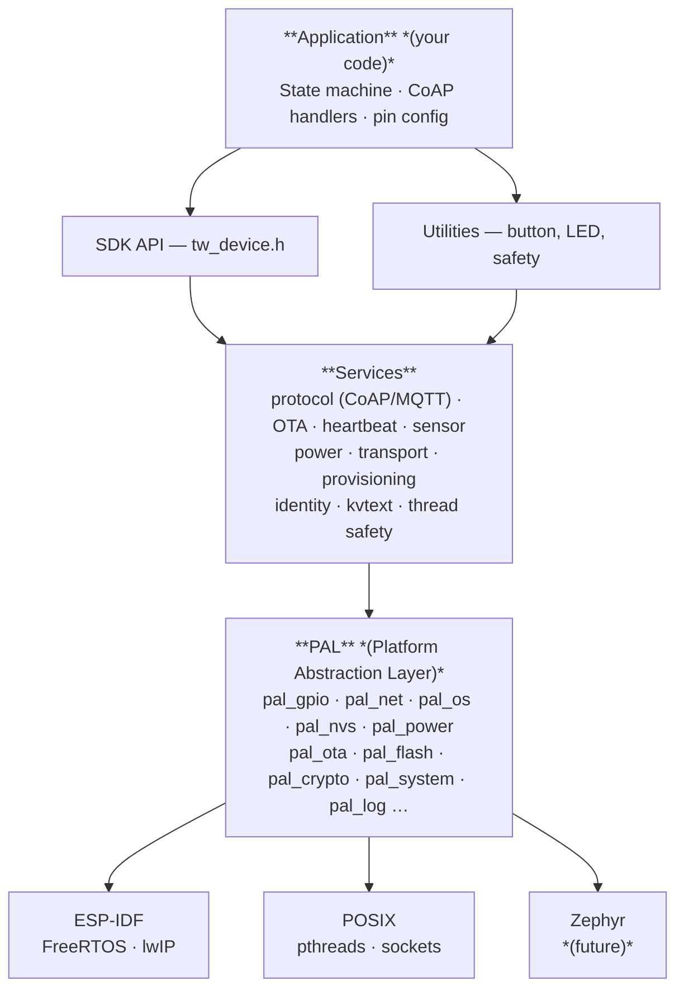
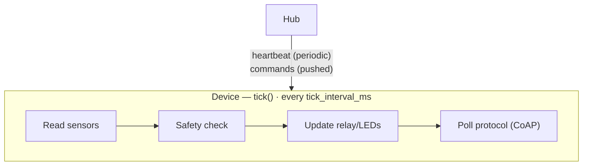

# Architecture

## Layer diagram

## Key rule

**Nothing above the PAL line includes platform headers.** No `freertos/`, no `esp_`, no `<pthread.h>`.
Only `pal_*.h`.
This is enforced by code review (a CI check should be added in the consuming project).

## Data flow

### Always-on mode

### Sleep mode

## Component responsibilities

| Component | What it does |
|-----------|--------------|
| `svc_device.c` | `tw_device_run()` -- main loop, lifecycle, deep sleep, graceful shutdown |
| `proto_coap.c` (`protocol/src/`) | CoAP backend for `tw_protocol_t` vtable, resource dispatch, Block1/Block2 |
| `proto_mqtt.c` (`protocol/src/`) | MQTT stub -- compile-time error if selected (future) |
| `svc_heartbeat.c` | Periodic POST to hub (protobuf payload), mailbox command dispatch |
| `svc_identity.c` | Two-phase identity management (factory + hub), `/tw/info` endpoint |
| `svc_ota.c` | OTA push receiver with SHA-256 verification, A/B rollback |
| `svc_applet.c` | WASM applet push/store/load (when enabled) |
| `svc_power.c` | Deep sleep orchestration, wake source config |
| `svc_sensor.c` | Sensor registry, periodic polling, thread-safe reads |
| `svc_provision.c` | Multi-method provisioning: BLE GATT, SoftAP+CoAP, LAN CoAP (protobuf) |
| `svc_transport.c` | Transport init based on Kconfig (WiFi, Ethernet, Thread, BLE) |
| `svc_config.c` | Typed NVS wrappers |
| `tw_kvtext.c` (`util/src/`) | INI-like key=value parser/writer for provisioning wire format |
| `tw_lock.h` | Optional mutex protection for shared SDK state (Kconfig-controlled no-op) |

## PAL contract

Each PAL header defines a small, stable interface.
Backends implement every function.
See the [PAL reference](../reference/pal.md) for the full specification.

| Header | Purpose |
|--------|---------|
| `pal_gpio.h` | Digital I/O, interrupt registration |
| `pal_i2c.h` | I2C bus read/write |
| `pal_net.h` | UDP socket open/send/recv |
| `pal_os.h` | Tasks, mutexes, semaphores, sleep, uptime |
| `pal_nvs.h` | Key-value persistent storage (encrypted on ESP32 via `CONFIG_TW_NVS_ENCRYPT`) |
| `pal_power.h` | Deep sleep, wake reason |
| `pal_ota.h` | OTA partition write/verify/commit |
| `pal_flash.h` | Raw flash read/write/mmap (for applets) |
| `pal_crypto.h` | SHA-256 (one-shot and incremental) for OTA verification |
| `pal_system.h` | Reboot, reboot-to-factory, boot reason, heap info |
| `pal_log.h` | Levelled logging |

## Protocol abstraction

All services communicate through the `tw_protocol_t` vtable defined in `tw_msg.h`.
`tw_protocol_create()` returns the backend selected in Kconfig:

| Config | Backend | Status |
|--------|---------|--------|
| `CONFIG_TW_PROTOCOL_COAP` | `proto_coap.c` | Implemented (default) |
| `CONFIG_TW_PROTOCOL_MQTT` | `proto_mqtt.c` | Stub -- compile-time `#error` |

Adding a new protocol means implementing the four vtable methods (`init`, `poll`, `deinit`, `send`) and adding a Kconfig choice.
No service code needs to change.

## Security model

| Feature | Implementation |
|---------|---------------|
| OTA image integrity | SHA-256 hash verified on `ota_commit` (opt-in via `CONFIG_TW_OTA_VERIFY_SIGNATURE`) |
| NVS storage | ESP32: `nvs_flash_secure_init` with `nvs_key` partition; POSIX: `chmod 0600` |
| Device identity | Ed25519 public key export or PSK, selectable via Kconfig |
| Transport encryption | Delegated to DTLS (CoAP) or TLS (MQTT) at the transport level |
| Applet sandboxing | WASM modules run inside WAMR's sandbox; host API controls what they can access |

## Thread safety

When `CONFIG_TW_THREAD_SAFETY=y` (default), all shared SDK state is protected by `tw_lock_t` mutexes.
Setting it to `n` compiles all lock operations to no-ops for single-threaded or resource-constrained builds.

Protected areas: identity state, sensor registry, OTA state, heartbeat builder, and power management state.

## Related documentation

- [Applet runtime](applet-runtime.md) -- WAMR integration and applet lifecycle
- [Wire specification](../protocol/wire-specification.md) -- canonical protocol reference
- [Hub protocol](../protocol/hub-protocol.md) -- heartbeat, mailbox, commands
