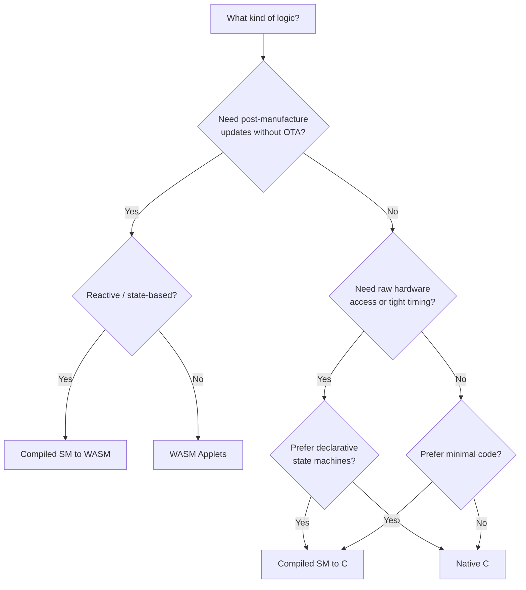

# Choosing Your Approach

Tinkwell Firmwareless supports three ways to deliver device logic.
They can coexist on the same device -- for example, a native C runtime that also accepts WASM applets pushed from the hub.

## The three paths

### WASM Applets

Write your logic in **any language** that compiles to `wasm32` -- TypeScript (AssemblyScript), Rust, C, or raw WAT.
The hub pushes the `.wasm` binary to the device at runtime over CoAP.
The device stores it in flash and runs it in a sandboxed WAMR interpreter.
Applets can be hot-swapped without rebooting.

**Best for:** post-manufacture logic changes, multi-language teams, rapid iteration without reflashing, in-factory functional tests.

### Compiled State Machines

Define behavior in the Tinkwell state machine DSL and compile it using the [state machines compiler](https://github.com/arepetti/tinkwell-firmwareless-statemachines-compiler).
The compiler handles sensor reads, GPIO writes, LED patterns, safety conditions, and transition logic.
Two compilation targets:

- **Native C** (`--target c`) -- generates a `.c` file that calls the device PAL directly.
  Compiles into firmware with zero runtime overhead.
  You implement sensor reads and wire `sm_init()`/`sm_tick()` into `tw_device_config_t`.
- **WASM** (`--target wat`) -- generates a `.wat` module pushed to the device the same way as a hand-written applet.

**Best for:** well-defined reactive logic (thermostats, safety interlocks, mode controllers), teams that prefer declarative over imperative, reducing hand-written code.

### Native C

Fill in a `tw_device_config_t` struct with your CoAP resources, sensor callbacks, and tick function.
The SDK provides the main loop, networking, OTA, heartbeat, and everything else.
About 50--200 lines of C for a typical device.

**Best for:** tight timing requirements, custom protocols, full hardware access, minimal runtime overhead.

## Trade-offs

| | WASM Applets | Compiled SM (WASM) | Compiled SM (C) | Native C |
|---|---|---|---|---|
| **Language** | Any wasm32 target | Tinkwell DSL | Tinkwell DSL | C |
| **Update mechanism** | Hot-push, no reboot | Same as applets | OTA + reboot | OTA + reboot |
| **Runtime overhead** | ~50 KB WAMR | Same | None | None |
| **Performance** | Interpreted | Interpreted | Native speed | Native speed |
| **Sandboxing** | WASM sandbox | Same | Full HW access | Full HW access |
| **Debugging** | Host-side logging | Manifest diagnostics | gdb, pal_log | gdb, valgrind |
| **Iteration speed** | Fastest: push and run | Fast: compile, push | Rebuild, reflash | Rebuild, reflash |

## Mixing approaches

A single device can combine approaches:

- **Native C base + applet override**: ship compiled firmware with default behavior, then push applets for customization or A/B testing.
  The SDK tick loop delegates to the applet when one is loaded.

- **State machine + native safety**: compile the control logic as a state machine, but keep safety overrides in native C (the `tw_safety_monitor` runs outside the WASM sandbox).

- **Applet for logic, native for drivers**: write custom I2C drivers in C (PAL extensions), expose them through the host API, and keep all application logic in applets.

## Decision guide

## Getting started with each path

- **WASM Applets**: [Your first applet](../getting-started/your-first-applet.md), then [Writing applets](writing-applets.md)
- **Compiled State Machines (WASM or C)**: see the [state machines compiler](https://github.com/arepetti/tinkwell-firmwareless-statemachines-compiler) repository for the DSL and compilation workflow.
  Use `--target c` for native firmware or `--target wat` for WASM applets.
- **Native C**: [Quick start](../getting-started/quick-start.md), then [Build your own device](../getting-started/build-your-device.md)
