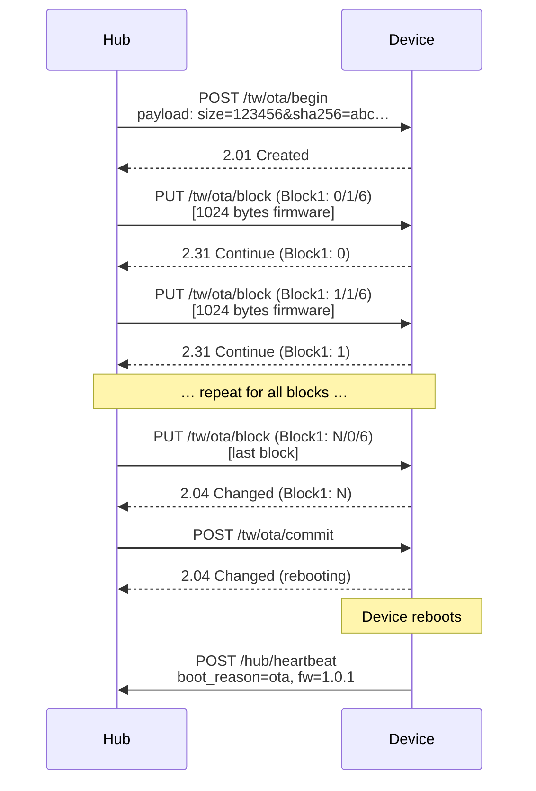

# OTA Updates

Push-based over-the-air firmware updates from the edge hub.

Wire layout and response codes follow the [wire specification](../protocol/wire-specification.md).
The SDK uses **binary CoAP** (RFC 7252) with **Block1** (RFC 7959) for firmware block transfers via libcoap.

## Flow



Block1 notation: `NUM/M/SZX` where NUM is the block sequence number, M is the "more" flag (1=more blocks, 0=last), and SZX is the size exponent (6 = 1024 bytes).

## Begin payload

`POST /tw/ota/begin` carries a **text** payload (kvtext-style).
The SDK locates `size=` and `sha256=` with `strstr` on the raw body:

```
size=123456&sha256=<64 hex chars>
```

`size` is a decimal byte count.
When present, `sha256` must be exactly **64 lowercase hexadecimal** characters (32 bytes), parsed with `sscanf(..., "%2x", ...)`.

## Block transfer

`PUT /tw/ota/block` **requires** the Block1 option (RFC 7959).
The device:

- Validates that `block1_num` matches the expected sequence.
- Writes the payload to the OTA partition.
- Updates the running SHA-256 hash.
- Echoes the Block1 option in the response.
- Responds `2.31 Continue` while `M=1`, or `2.04 Changed` for the final block.

Requests without Block1 are rejected with `4.00 Bad Request`.

## Partition layout

The device uses A/B OTA partitions (ESP-IDF):

- `ota_0`: Currently running firmware
- `ota_1`: Target for the new firmware
- `otadata`: Tracks which partition to boot

After commit, `otadata` is updated to boot from the new partition.

## Verification

1. **Size check**: received bytes must match the declared size.
2. **SHA-256** (when `CONFIG_TW_OTA_VERIFY_SIGNATURE=y`): hub provides the hash in the `begin` payload.
3. **Signature** (future): Ed25519 signature over the image hash.

## Rollback

After rebooting into new firmware:

1. `pal_ota_is_pending_verify()` returns `true`.
2. The SDK starts a rollback timer (`CONFIG_TW_OTA_ROLLBACK_TIMEOUT_S`).
3. If the application runs successfully and the first heartbeat succeeds, `pal_ota_mark_valid()` is called.
4. If the timer expires without validation, `pal_ota_rollback()` reverts to the previous partition.

## Status query

`GET /tw/ota/status` returns kvtext:

```
state=1&progress=47&received=58368&expected=123456
```

States: 0=idle, 1=receiving, 2=verifying, 3=rebooting, 4=pending_verify, 5=error.

## Related documentation

- [Wire specification](../protocol/wire-specification.md) -- canonical protocol reference
- [ESP-IDF guide](esp-idf.md) -- partition tables and flash layout
- [Kconfig reference](../reference/kconfig.md) -- OTA configuration options
