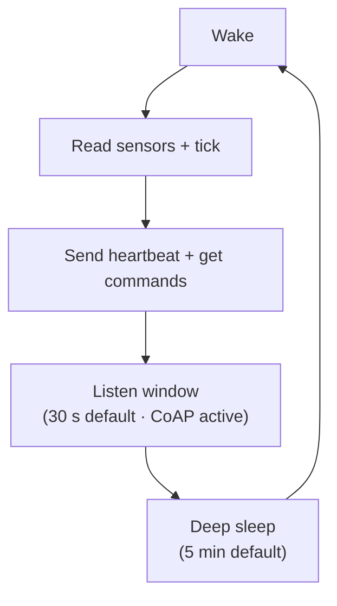

# Power Management

## Always-On Mode (default)

The device stays awake continuously:

- CoAP server always accepting requests.
- Main loop ticks at `tick_interval_ms`.
- Heartbeat sent every `CONFIG_TW_HEARTBEAT_INTERVAL_S` (default 60s).
- Hub can push commands at any time.

Use when: mains-powered, requires instant response.

## Deep Sleep Mode

Enabled via `CONFIG_TW_POWER_DEEP_SLEEP=y`.

### Cycle

### Configuration

| Kconfig | Default | Description |
|---------|---------|-------------|
| `CONFIG_TW_SLEEP_INTERVAL_S` | 300 | Sleep duration between cycles |
| `CONFIG_TW_SLEEP_LISTEN_WINDOW_S` | 30 | Active window after heartbeat |

### Wake sources

- **Timer**: Primary.
  Device wakes after `SLEEP_INTERVAL_S`.
- **GPIO**: Optional. A button press or sensor interrupt can wake the device early.
  Configure via `pal_power_set_wake_gpio()`.

### RAM retention

During deep sleep, only RTC memory is preserved (on ESP32).
All variables are lost.
The application should:

1. Store important state in NVS before sleep (`on_sleep` callback).
2. Restore state from NVS after wake (`on_wake` callback).

### Heartbeat integration

In sleep mode, the heartbeat is critical:

1. It's the device's only chance to tell the hub it's alive.
2. The hub returns queued commands in the heartbeat response.
3. The listen window allows the hub to push additional data (OTA blocks, applet chunks) immediately after the heartbeat.

### Power consumption (ESP32-C6)

| State | Current |
|-------|---------|
| Active (WiFi TX) | ~150 mA |
| Active (WiFi idle) | ~80 mA |
| Light sleep | ~800 µA |
| Deep sleep | ~7 µA |
| Deep sleep (RTC + GPIO wake) | ~8 µA |

With a 300s sleep / 30s wake cycle, average consumption is roughly: `(80 * 30 + 0.007 * 300) / 330 ≈ 7.3 mA` -- feasible on battery.

## Related documentation

- [Hub protocol](../protocol/hub-protocol.md) -- listen windows and command delivery
- [Kconfig reference](../reference/kconfig.md) -- all power management options
- [Architecture overview](../architecture/overview.md) -- sleep mode data flow
