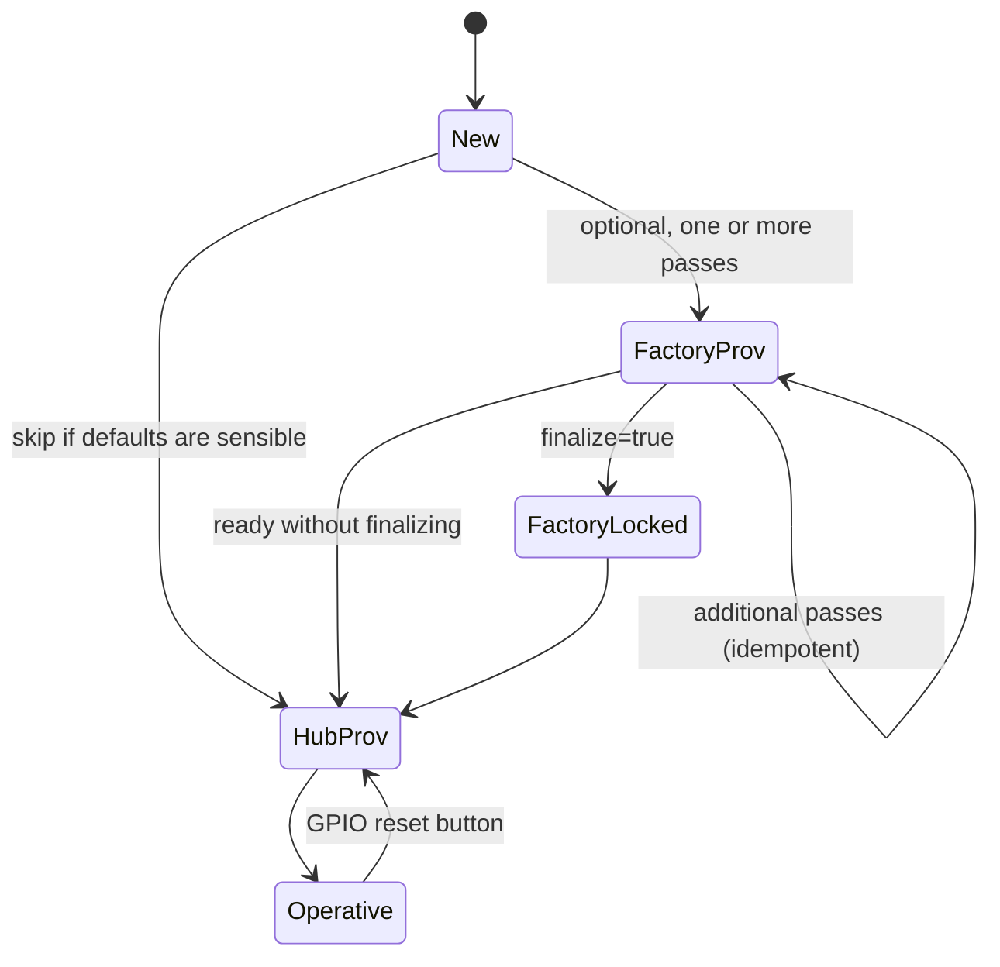
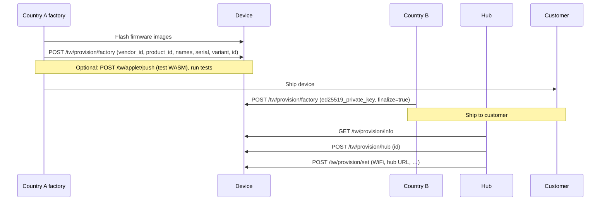

# Provisioning

This document describes the **partition-isolated** provisioning model: **Protocol Buffer** payloads on CoAP (`tw_protocol.proto`), **NVS** as the durable source of truth, **idempotent factory provisioning** with optional finalization, and **hub provisioning** that assigns the operational device identity and network settings.

For field-level protobuf definitions, see `proto/tw_protocol.proto`.
For transport details and CoAP codes, see the [wire specification](../protocol/wire-specification.md).

---

## Lifecycle overview

High-level states and transitions:



- **New** — First boot; NVS has no complete hub provisioning (and possibly no factory data).
- **FactoryProv** — Optional, repeatable factory identity steps via `POST /tw/provision/factory`.
- **FactoryLocked** — Factory provisioning was **finalized** (`finalize=true`); further factory calls receive **4.03 Forbidden**.
- **HubProv** — Hub assigns the 16-byte device `id`, WiFi, hub URL, etc.
- **Operative** — Main application runs; provisioning firmware is not loaded.

---

## States in detail

### New / first boot

On boot, the **main application** checks NVS (via `svc_provision_is_needed()` and related identity state).

- **ESP-IDF (partition layout):** If hub provisioning is still required, the main app **does not** embed provisioning services.
  It **reboots into the provisioning firmware partition**, which owns BLE, SoftAP, LAN CoAP, and all `/tw/provision/*` handlers.
- **POSIX / host builds:** There is no separate partition; the SDK may run **inline provisioning** (for example environment-variable based) in the same process.

### Factory provisioning (optional, idempotent)

Factory provisioning uses **`POST /tw/provision/factory`** with a **`FactoryProvisionCmd`** protobuf body.

- **Idempotent:** Only **non-default** fields in the command are written.
  The same endpoint may be called **multiple times** (for example across different factory stations or countries) until the factory region is locked.
- **`finalize`:** When **`finalize=true`** is applied successfully, factory provisioning is **permanently locked**.
  Subsequent `POST /tw/provision/factory` calls return **4.03 Forbidden** (factory finalized).
- **Without finalizing:** The device may move to hub provisioning once identity fields are satisfactory; locking is optional until you send `finalize=true`.

**Kconfig:** `CONFIG_TW_FACTORY_PROVISION_REQUIRED` — When **enabled**, **hub provisioning is rejected** until at least one successful factory provisioning pass has established factory identity as required by the implementation.
When **disabled** (default), hub provisioning may proceed immediately if compile-time defaults are acceptable.

Typical factory fields include `vendor_id`, `product_id`, display names, `serial_number`, `variant`, optional initial `id` (GUID bytes), `psk`, and `ed25519_private_key` (see `FactoryProvisionCmd` in `tw_protocol.proto`).

### Hub provisioning

Hub provisioning assigns the **operational 16-byte GUID** and network/hub parameters.

1. **`POST /tw/provision/hub`** — Body: **`HubProvisionCmd`**.
   The meaningful field is **`id`** (16-byte GUID assigned by the hub).
2. **`POST /tw/provision/set`** — Body: **`ProvisionSetCmd`**: repeated **`ConfigEntry`** rows.
   The following keys are accepted:
   - `ssid` / `wifi-ssid` — WiFi station SSID
   - `password` / `wifi-pass` — WiFi station password
   - `hub-url` — Hub CoAP address (e.g. `coap://192.168.1.10:5684`)
   - **`APP_*`** — Any key starting with `APP_` is stored as an application-defined NVS setting.
     This allows provisioning to customize device behavior (e.g. `APP_temp_min`, `APP_temp_max` for a thermostat safety range) without involving application code in the provisioning flow.
     The application reads these at runtime via `tw_config_get_i32()` / `tw_config_get_str()`.
   - All other keys are **rejected** to prevent arbitrary NVS overwrites.
   - WiFi, hub, and `APP_*` keys remain writable **even after factory provisioning is finalized** — they are operational settings, not factory identity.
3. **`GET /tw/provision/info`** — Response: **`ProvisionInfo`**, including nested device information, **`factory_done`**, and **`factory_finalized`**.

These requests are served from the **provisioning partition** when using split images; payloads are **binary protobuf**, not text.

### Operative

The **main app partition** runs the product firmware: CoAP server for hub-directed commands, heartbeat, OTA, applets, telemetry, etc. **Provisioning code is not part of this image** in the split layout.

- **BLE** is **off by default** in the main app Kconfig (`CONFIG_TW_TRANSPORT_BLE` defaults to `n`) to save flash and RAM; enable only if BLE is a **runtime** transport, not only for provisioning.
- Provisioning remains available by rebooting into the provisioning partition (for example after user reset — see below).

### Re-provisioning

- **User-initiated only:** A **GPIO reset** path clears **hub** provisioning and reboots toward provisioning mode.
  There is **no** automatic re-provisioning on WiFi failure.
- **What is preserved:** **Factory identity** and the **`factory_finalized`** flag remain in NVS unless explicitly erased by other means (full flash erase, etc.).

See [GPIO reset button](#gpio-reset-button).

---

## Partition layout

| Region | Role |
|--------|------|
| **Provisioning partition** | BLE (when enabled in that image), SoftAP, LAN provisioning, CoAP server for **all** `/tw/provision/*` endpoints. Smaller, provisioning-focused binary. |
| **Main app partition** (`ota_0` / `ota_1`) | CoAP server for operational resources (`/tw/info`, `/tw/set-config`, OTA, applets, heartbeat listeners, etc.). **No** provisioning stack unless you build a monolithic variant. **No BLE** unless explicitly enabled for runtime use. |
| **NVS** | Stores provisioning and identity state; **survives** OTA firmware updates. |

Example split layout (see `partitions_factory.csv` in the device tree): provisioning **factory** slot **256 KB**, main application slots **1.25 MB** each, plus `nvs`, `otadata`, and storage as defined by your product.

---

## Multi-country manufacturing flow

Manufacturing can split **non-secret** identity steps and **secret key injection** across sites.
**WASM applets** (if enabled) allow in-factory functional tests without reflashing between test and production applet payloads.



- **Country A** can record SKU, serial, variant, labels, and optional initial `id` without handling long-term signing keys.
- **Country B** (or a secure room) injects **`ed25519_private_key`** and may set **`finalize=true`** to lock factory configuration before retail.
- **Customer / hub onboarding** uses **hub** + **set** after the device is on the right network path (SoftAP, LAN, or pre-staged Ethernet/WiFi depending on product).

---

## WASM applets for in-factory testing

When the firmware is built with the applet runtime and a suitable partition layout:

1. **Provision** minimally as needed for the test (factory and/or hub steps).
2. Push a **test applet** with **`POST /tw/applet/push`** (raw WASM via Block1), then **`POST /tw/applet/commit`** per your OTA/applet flow.
3. Run automated or manual tests.
4. Push a **production applet** or **re-flash** if the product does not use WASM for production logic.

Because applet updates are **partition or staged writes**, you often **do not need a full reflash** between a test and production WASM when both fit your security and signing policy.

---

## GPIO reset button

| Kconfig | Meaning | Default |
|---------|---------|---------|
| `CONFIG_TW_REPROVISION_GPIO` | Enable GPIO hold-to-reset for re-provisioning | `n` |
| `CONFIG_TW_REPROVISION_GPIO_PIN` | Button GPIO (active low, internal pull-up) | `9` |
| `CONFIG_TW_REPROVISION_GPIO_HOLD_S` | Seconds to hold before trigger | `5` |

When triggered, the implementation **clears hub provisioning** and reboots toward the **provisioning** path while **preserving factory identity** and **`factory_finalized`**.

---

## Provisioning endpoints (CoAP, protobuf)

Request and response bodies are **binary protobuf** (nanopb on device).
UDP port **5683** on the device for CoAP (see the [wire specification](../protocol/wire-specification.md)).

| Endpoint | Method | Request | Response | Notes |
|----------|--------|---------|----------|-------|
| `/tw/provision/factory` | POST | `FactoryProvisionCmd` | `ProvisionReply` | Idempotent until finalized; **4.03** if `factory_finalized` |
| `/tw/provision/hub` | POST | `HubProvisionCmd` | `ProvisionReply` | **`id` only** (16-byte GUID); requires factory first if `CONFIG_TW_FACTORY_PROVISION_REQUIRED` |
| `/tw/provision/set` | POST | `ProvisionSetCmd` | `ProvisionReply` | WiFi, hub URL, `APP_*` app settings; always writable (even post-finalize) |
| `/tw/provision/info` | GET | — | `ProvisionInfo` | Includes **`factory_done`**, **`factory_finalized`** |

---

## Resource budget reference (approximate)

Figures are **order-of-magnitude** for planning; actual sizes depend on chip, IDF version, optimization, and enabled features.

| Image | Flash (partition cap) | Typical use | RAM at runtime (approx.) |
|-------|------------------------|-------------|----------------------------|
| **Provisioning** | **256 KB** slot (`0x40000` in `partitions_factory.csv`) | BLE + WiFi SoftAP/station + libcoap + nanopb + provisioning handlers | **~90--140 KB** — BLE and SoftAP dominate; CoAP stack adds tens of KB. |
| **Main app** | **1.25 MB** per OTA slot (`0x140000`) | CoAP, heartbeat, OTA, sensors, optional WASM | **~80--200 KB** — Lower when BLE is left disabled in main app (SDK notes **~100 KB flash** and **~35 KB RAM** saved when BLE is not linked for runtime). |

Use `idf.py size` / `size-components` on your exact `sdkconfig` for shipping numbers.
The **partition table** defines **upper bounds**; keep images under the allocated app slots and reserve headroom for growth.

---

## Build and flash (split layout)

From the device tree, unified scripts merge provisioning and main images when requested:

```bash
# Linux/macOS
./scripts/build_flash.sh thermostat --factory --target esp32c3
```

```powershell
# Windows (PowerShell)
.\scripts\build_flash.ps1 -Example thermostat -Factory -Target esp32c3
```

See [`scripts/README.md`](../../scripts/README.md) for options and [`provision.py`](../../scripts/provision.py) for CLI-driven factory/hub flows against a running device.

---

## Related documentation

- [Wire specification](../protocol/wire-specification.md) -- CoAP resources, protobuf usage, ports
- [Hub protocol](../protocol/hub-protocol.md) -- hub-facing behavior after provisioning
- [Kconfig reference](../reference/kconfig.md) -- SDK configuration options
