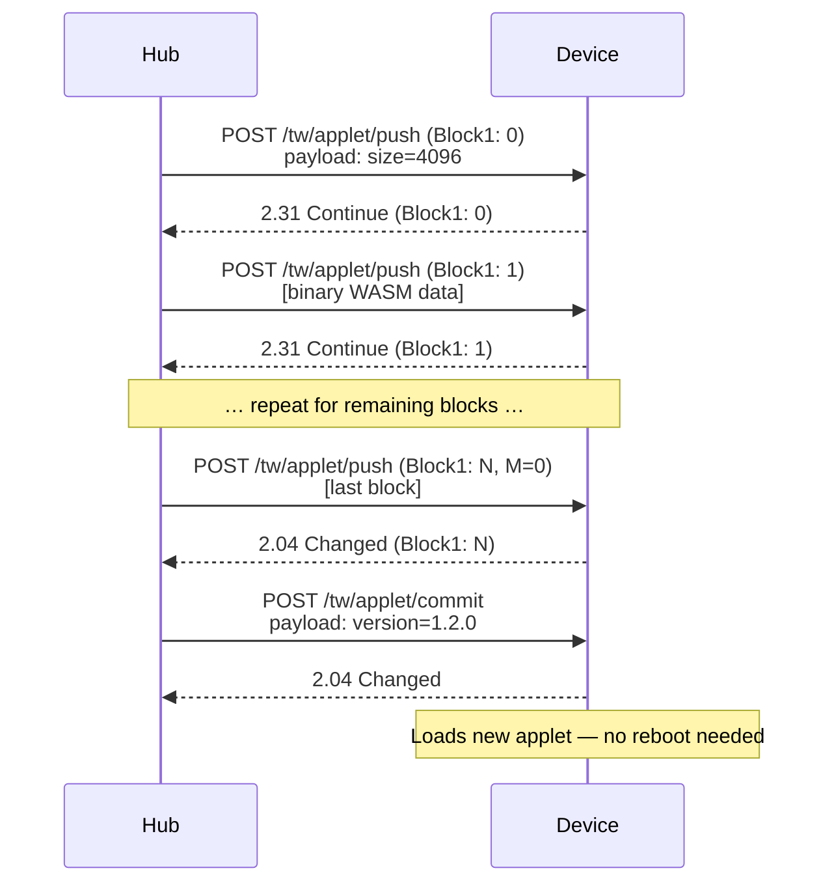

# Applet Protocol

Push-based WASM applet deployment from the hub to an applet-driven device.

Wire layout follows the [wire specification](wire-specification.md).
Transfers use **CoAP Block1** (RFC 7959) for the binary push, with the device validating block sequence and streaming data to flash.

## Overview

The applet protocol mirrors the OTA protocol but targets a separate flash partition (`applet`) and does not require a reboot.
The device can hot-swap running applets.

## Flow



## Flash Layout

```
+----------------------------------------------+
|  applet partition (384 KB default)           |
+----------------------------------------------+
|  Header (32 bytes)                           |
|    magic: 0x544D5741 ("TWMA")               |
|    version: 32-byte string                   |
|    size: uint32 (little-endian)              |
|    crc32: uint32 (little-endian)             |
+----------------------------------------------+
| WASM binary (up to CONFIG_TW_APPLET_MAX_SIZE)|
+----------------------------------------------+
|  (unused)                                    |
+----------------------------------------------+
```

## Execute-In-Place (XIP)

On ESP32, the applet partition is memory-mapped via `esp_partition_mmap()`.
WAMR reads the WASM bytecode directly from the mapped address without copying to RAM.

Only the interpreter's working memory (stack + heap) lives in RAM:
- Stack: `CONFIG_TW_WASM_STACK_SIZE` (default 8 KB)
- Heap: `CONFIG_TW_WASM_HEAP_SIZE` (default 32 KB)

## Hot-Swap Procedure

1. Stop calling `applet_tick()` in the main loop.
2. Call `wasm_runtime_unload()` to destroy the WAMR module instance.
3. Erase the applet partition.
4. Write the new WASM binary.
5. `pal_flash_mmap()` the partition.
6. Call `wasm_runtime_load()` to create a new module instance.
7. Call `applet_init()` in the new module.
8. Resume `applet_tick()` calls.

## Status

`GET /tw/applet/status` returns:

```
state=3&version=1.2.0&size=4096
```

States: 0=none, 1=loading, 2=error, 3=running.
