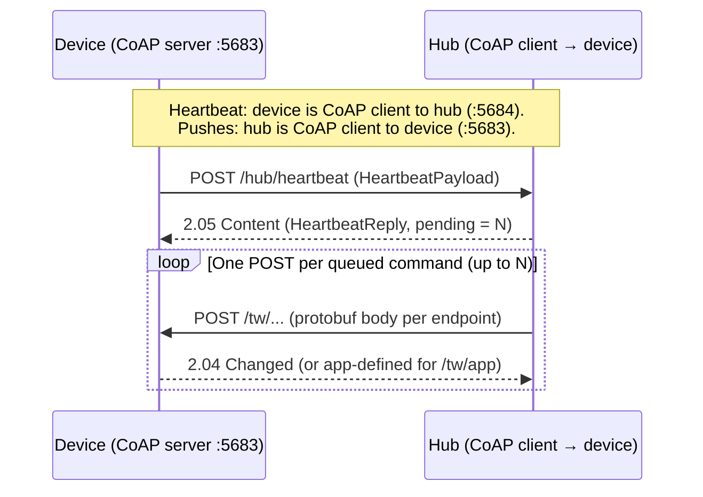
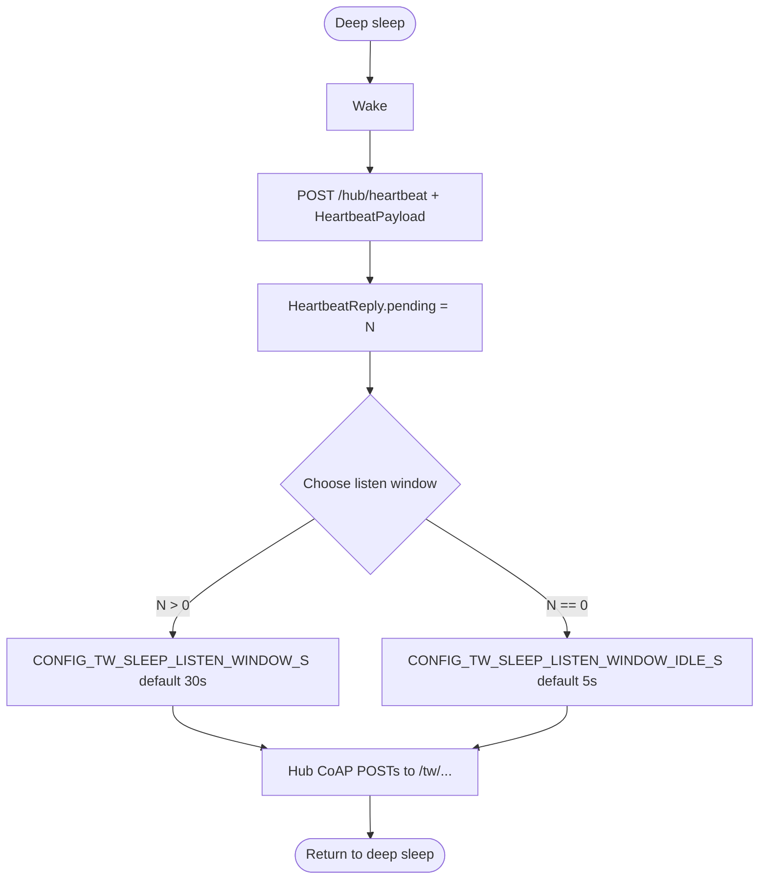

# Hub heartbeat and hub-push command protocol

This document describes how a firmwareless Tinkwell device exchanges heartbeats and hub-pushed commands with an edge hub over **binary CoAP** using **Protocol Buffers** (`proto/tw_protocol.proto`).
For transport details, UDP ports, and the full endpoint matrix, see the [wire specification](wire-specification.md).

---

## Overview

The device has no direct internet path to the cloud; it talks to a **Tinkwell edge hub** on the LAN via CoAP.
The hub may queue work for the device (configuration, OTA hints, application payloads, reboot).

The device must actively signal that it is reachable because:

- In deep sleep, the radio is off most of the time.
- In always-on mode, the hub still needs a periodic liveness signal.
- There may be no sensor delta to trigger traffic.

Payloads on the heartbeat and command paths are **protobuf**, not the older kvtext mailbox format.

---

## Hub address

The hub CoAP address is set during provisioning and stored in NVS.
The application or hub can update it via **`POST /tw/set-config`** (`SetConfigCmd`) with appropriate `ConfigEntry` rows (for example keys such as `hub.url`, depending on your stack).

---

## Hub-push model (protobuf)

Commands are **not** bundled inside the heartbeat response.
The heartbeat only tells the hub that the device is online and carries telemetry-style status; the hub replies with **how many** separate push operations it intends to perform.
Each command is then delivered as its own **CoAP POST** from the hub (acting as CoAP client) to the device (CoAP server).

### Flow

1. The device sends **`POST /hub/heartbeat`** with a **`HeartbeatPayload`** protobuf body.
2. The hub responds with **`2.05 Content`** and a **`HeartbeatReply`** protobuf whose **`pending`** field is **N** — the number of commands the hub will push in this cycle.
3. The hub opens **N** inbound CoAP **POST** requests to the device’s command endpoints (UDP **5683** by default), one request per command, each carrying the protobuf type that matches that resource (or an empty body for reboot).



### No bundled commands in the heartbeat

The **`HeartbeatReply`** contains only **`pending`** (a count).
It does **not** include command types, hex blobs, or multiple commands in one message.
Bulk mailbox lines such as `cmd:<type>:<hex>` are **not** used in this model.

---

## Command endpoints on the device

The hub must map each queued operation to exactly one of these resources.
Prefix **`tw`** matches the SDK default; your deployment may use a different URI prefix if configured.

| Endpoint | Method | Request body | SDK / app behavior |
|----------|--------|----------------|---------------------|
| `/tw/reboot` | POST | **Empty** | SDK handles reboot (`pal_system_reboot()`); **`on_command` is not used** for this path. |
| `/tw/set-config` | POST | **`SetConfigCmd`** | With **`CONFIG_TW_USE_PROTOBUF`**: SDK decodes protobuf and applies each **`ConfigEntry`** via **`tw_config_set_str`** — **`on_command` is not invoked** (no extra app hook). Without protobuf, **`on_command("set-config", …)`** receives the raw body. |
| `/tw/ota-available` | POST | **`OtaAvailableCmd`** | SDK stores OTA metadata for the OTA service; then invokes **`on_command`** with **`ota-available`** and the **raw protobuf** bytes (when **`on_command`** is set). |
| `/tw/app` | POST | **`AppCmd`** | SDK decodes protobuf and invokes **`on_command`** with **`app`** and the **inner `payload`** bytes (opaque app data). |

Ordering and retries between those **N** pushes are **hub policy**.
The device should accept POSTs until the listen window ends (deep sleep builds) or indefinitely (always-on).

---

## Timing and listen windows

### Always-on devices

The device keeps the CoAP server up.
The hub may push commands **whenever** the device is reachable; there is **no** post-heartbeat listen window constraint driven by sleep.
Heartbeat period is controlled by **`CONFIG_TW_HEARTBEAT_INTERVAL_S`** (default **60** s), with optional boot heartbeat via **`CONFIG_TW_HEARTBEAT_ON_BOOT`**.

### Deep sleep devices

After sending the heartbeat and receiving **`HeartbeatReply`**, the device stays in a **listen window** so the hub has time to issue all **`pending`** CoAP POSTs to the device.

- **Commands expected (`pending` > 0):** use **`CONFIG_TW_SLEEP_LISTEN_WINDOW_S`** (default **30** s).
  The hub should complete all pushes within this window.
- **No commands (`pending` == 0):** use **`CONFIG_TW_SLEEP_LISTEN_WINDOW_IDLE_S`** (default **5** s) — a shorter window so the device returns to sleep faster when there is nothing to push.

If **`CONFIG_TW_SLEEP_LISTEN_WINDOW_IDLE_S`** is **0**, the device may sleep immediately after a heartbeat with **`pending == 0`**.

Optional **`CONFIG_TW_SLEEP_LISTEN_EXTEND_ON_CMD`**: when enabled, each received command can reset the listen timer so long-running hub sequences stay within an extended window (see Kconfig help text).



---

## Sensor telemetry

Sensor samples can reach the hub in two ways:

1. **Inline on heartbeat:** populate **`HeartbeatPayload.sensors`** (repeated **`SensorReading`**).
   This avoids an extra round trip when you already send a heartbeat (for example after wake).
2. **Dedicated push:** **`POST /hub/telemetry`** with a **`TelemetryPush`** message (repeated **`SensorReading`** in **`readings`**).
   Use this when telemetry cadence differs from heartbeat or when you batch readings separately.

The hub responds to **`POST /hub/telemetry`** with **`TelemetryReply`**, which may set **`next_interval_s`** to suggest a new telemetry period in seconds.
A value of **0** means “keep the current interval.”

---

## JSON examples (protobuf JSON mapping)

For tooling, tests, and the **`tw coap server`** simulator, payloads are often edited as **JSON** using **protobuf JSON conventions** (camelCase names; **`bytes`** as base64).
On the wire, CoAP still carries **binary protobuf** unless a tool encodes from JSON internally.

### `SensorReading`

```json
{
  "name": "temperature",
  "value": 23.5,
  "timestampMs": 1711800000000
}
```

### `HeartbeatPayload`

```json
{
  "id": "AAAAAAAAAAAAAAAAAAAAAA==",
  "vendorId": 1,
  "productId": 42,
  "serialNumber": 12345,
  "fwVersion": "1.0.0",
  "uptimeMs": 3600000,
  "freeHeap": 45000,
  "bootReason": 0,
  "appData": "",
  "sensors": [
    {
      "name": "temperature",
      "value": 22.1,
      "timestampMs": 1711800000000
    }
  ]
}
```

### `HeartbeatReply`

```json
{
  "pending": 2
}
```

### `SetConfigCmd`

```json
{
  "entries": [
    { "key": "wifi.ssid", "value": "MyNetwork" },
    { "key": "log.level", "value": "info" }
  ]
}
```

### `OtaAvailableCmd`

```json
{
  "url": "https://updates.example.com/fw/v1.2.3.bin",
  "sha256": "AAAAAAAAAAAAAAAAAAAAAAAAAAAAAAAAAAAAAAAAAAA=",
  "sizeBytes": 524288
}
```

`sha256` is 32 bytes in protobuf; in JSON it is base64-encoded.

### `AppCmd`

```json
{
  "payload": "c29tZSBvcGFxdWUgYnl0ZXM="
}
```

### `TelemetryPush`

```json
{
  "readings": [
    {
      "name": "humidity",
      "value": 55.0,
      "timestampMs": 1711800001000
    }
  ]
}
```

### `TelemetryReply`

```json
{
  "nextIntervalS": 60
}
```

---

## CLI: simulating the hub

The **`tw`** CLI can run a CoAP server that behaves like a hub’s heartbeat side and queues outbound pushes to the device:

```text
tw coap server --mailbox /hub/heartbeat --prefix tw
```

Default listen address is **`0.0.0.0:5684`** (hub side; override with **`--bind`** / **`--port`**).
The device is contacted at the heartbeat client’s source address on port **5683** for each push.

- **`--mailbox /hub/heartbeat`** — serves the mailbox path the device POSTs to; responds with binary **`HeartbeatReply`** (**`pending`** = queued command count), then asynchronously issues one CoAP **POST** per queued item to **`/{prefix}/{command}`** on the device.
- **`--prefix tw`** — dispatches to **`/tw/reboot`**, **`/tw/set-config`**, **`/tw/ota-available`**, **`/tw/app`** (matches SDK defaults).

Queue commands for delivery after the next **`POST /hub/heartbeat`** using repeatable **`--queue`**:

```text
--queue command[:json]
```

Known commands **`set-config`**, **`ota-available`**, and **`app`** accept optional JSON after the first **`:`**; the CLI transcodes JSON to protobuf.
**`reboot`** uses an empty POST body.

Examples (repeat **`--queue`** for multiple commands; quote for your shell if JSON contains spaces):

```text
tw coap server --mailbox /hub/heartbeat --prefix tw --queue reboot
```

```text
tw coap server --mailbox /hub/heartbeat --prefix tw --queue set-config:{"entries":[{"key":"wifi.ssid","value":"Home"}]}
```

In interactive mode (default), type **`command[:json]`** lines on stdin to enqueue additional pushes after the server starts.

---

## Application integration: `on_command`

The legacy **`on_hub_command` / `tw_hub_command_t`** mailbox-style callback is replaced by a single string-keyed handler.
The application receives hub-originated work through:

```c
tw_err_t (*on_command)(const struct tw_device_config *dev,
                       const char *command,
                       const uint8_t *payload, size_t payload_len);
```

| `command` | Meaning | `payload` |
|-----------|---------|-----------|
| `"set-config"` | Config push | Only used when protobuf is **disabled**: raw body bytes. With default protobuf builds, **`set-config` is not delivered here** — the SDK applies **`SetConfigCmd`** internally. |
| `"ota-available"` | OTA metadata | Raw **`OtaAvailableCmd`** protobuf bytes (after the SDK records URL/size/hash for the OTA service). |
| `"app"` | Application channel | Opaque bytes from **`AppCmd.payload`** (not the full `AppCmd` wrapper). |

**`POST /tw/reboot`** does not invoke **`on_command`**; the SDK reboots immediately after responding.

Register the callback on **`tw_device_config_t`** alongside **`heartbeat_payload`** and other hooks.
Example skeleton:

```c
static tw_err_t my_command(const struct tw_device_config *dev,
                           const char *command,
                           const uint8_t *payload, size_t payload_len)
{
    if (strcmp(command, "app") == 0) {
        /* Decode or dispatch opaque app bytes */
    }
    (void)dev;
    (void)payload;
    (void)payload_len;
    return TW_OK;
}

static const tw_device_config_t config = {
    .name = "sensor",
    .fw_version = "1.0.0",
    /* ... identity, resources ... */
    .on_command = my_command,
};
```

---

## Related documentation

| Topic | Document |
|--------|----------|
| Full wire format, ports, **`GET /tw/info`** (`DeviceInfo`), OTA/applet endpoints | [Wire specification](wire-specification.md) |
| Power modes and sleep interval Kconfig | [Power management](../guides/power-management.md) |
| Schema source | `proto/tw_protocol.proto` |

---

## NVS key layout (identity)

Identity storage for provisioning and hub assignment is unchanged in broad terms; see the [provisioning guide](../guides/provisioning.md) for field-by-field tables.
Hub URL and related runtime keys are typically updated through **`SetConfigCmd`** rather than heartbeat kvtext lines.
