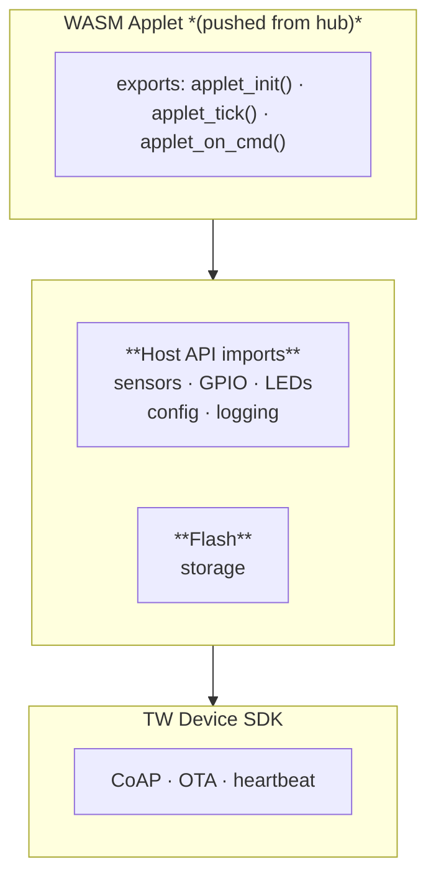

# Applet-Driven Device Example

A Tinkwell Firmwareless device where the application logic is not compiled in but pushed as a WASM binary from the hub at runtime.
Built on the same [TW Device SDK](../../tw-device-sdk/) as the thermostat, demonstrating an alternative approach to device development: instead of shipping compiled C logic, the hub pushes small WebAssembly applets that the device interprets.

## How it works

1. Device boots with no applet, sends a heartbeat to the hub (`applet_version=null`)
2. Hub pushes a `.wasm` binary via CoAP Block1 to `/tw/applet/push`
3. Device stores the binary in flash, loads it into the WAMR interpreter
4. WAMR calls `applet_init()`, then `applet_tick()` every second
5. The applet interacts with hardware through host function imports

The applet can be replaced at runtime without rebooting.

## Architecture



## Building the runtime

```bash
cmake -B build -DPAL_BACKEND=posix
cmake --build build
./build/applet_device
```

## Building applets

The `applets/` directory contains the same blinky example in four languages, plus a full thermostat in AssemblyScript:

| Directory | Language | Build command |
|-----------|----------|---------------|
| `thermostat-as/` | AssemblyScript | `npm install && npm run build` |
| `blinky-rs/` | Rust | `cargo build --target wasm32-unknown-unknown --release` |
| `blinky-as/` | AssemblyScript | `npm install && npm run build` |
| `blinky-c/` | C (freestanding) | `make` (requires clang with wasm32) |
| `blinky-wat/` | WAT (hand-written) | `wat2wasm blinky.wat -o blinky.wasm` |

All applets export the same three functions and import the same host API.
The source language doesn't matter -- only the `.wasm` binary.

## CoAP resources

| Method | Path | Description |
|--------|------|-------------|
| GET | `/tw/sensor/temperature` | Forwarded to applet |
| GET | `/tw/applet/status` | Applet state: none/running |

Plus SDK auto-registered resources for OTA and applet push.

## Documentation

- [Writing applets](../../docs/guides/writing-applets.md) -- applet contract, language guides, testing
- [Host API reference](../../docs/reference/host-api.md) -- all functions available to applets
- [Applet runtime](../../docs/architecture/applet-runtime.md) -- WAMR, flash storage, lifecycle
- [Your first applet](../../docs/getting-started/your-first-applet.md) -- 5-minute walkthrough

## Status

This is a skeleton.
WAMR integration is stubbed out -- the lifecycle and host API are fully defined but the actual interpreter is not yet wired in.
The applet source examples are complete and buildable.
